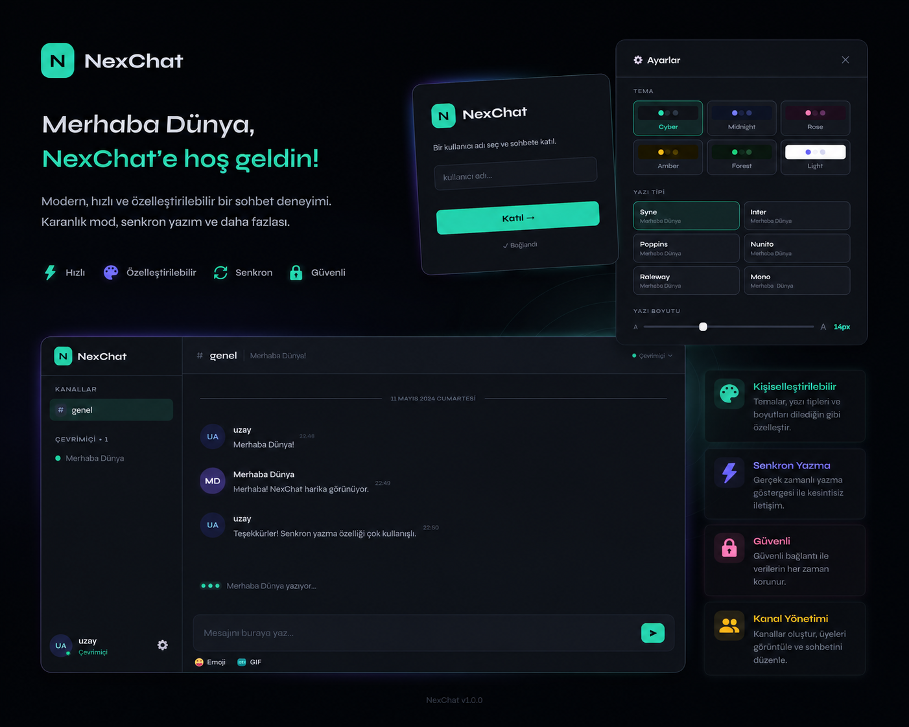

# NexChat 🟢

NexChat, **WebSocket tabanlı gerçek zamanlı bir sohbet uygulamasıdır**.  
Node.js ve WebSocket (`ws` paketi) kullanılarak geliştirilmiştir.  

Bu proje, **kullanıcı gizliliğine önem veren, log tutmayan bir sohbet deneyimi** sunar.  
Amacı, **test, öğrenme ve küçük gruplar için güvenli bir chat ortamı sağlamak** ve kısıtlı ağlarda deneme imkanı vermektir.  

---

## Özellikler

- Gerçek zamanlı mesajlaşma
- Kullanıcı listesi ve sohbet odaları
- Modern, minimalist arayüz
- GIF paylaşımı (Giphy API)
- **Log tutmaz, kullanıcı gizliliğine önem verir**
- Kolay deploy (Render veya benzeri PaaS platformları)
